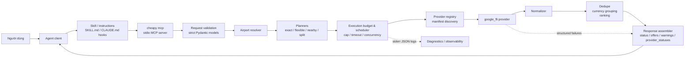
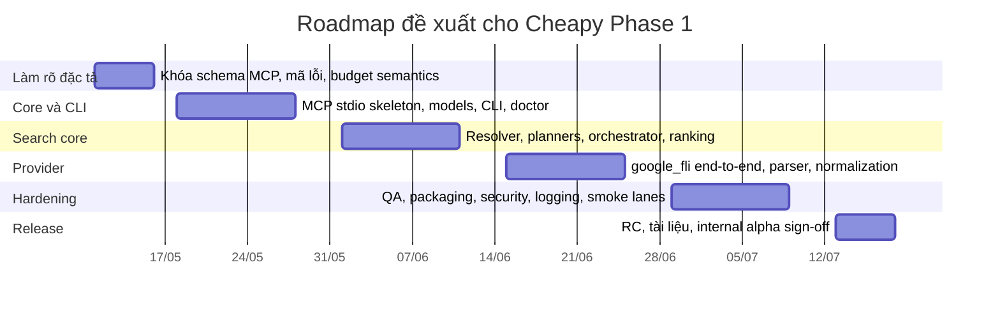

# Báo cáo thẩm định đặc tả dự án Cheapy

Nguồn phân tích là bản **“Cheapy Master Spec Design”** ngày **2026-05-08**. Tài liệu định nghĩa Cheapy là một package Python kiêm stdio MCP server cho bài toán tìm vé máy bay giá rẻ theo mô hình **agent-first**, trong đó phase 1 ưu tiên internal testing nhưng vẫn phải được triển khai như một package sản phẩm thật vì installer MCP, provider loading và live smoke tests đều là một phần của sản phẩm. fileciteturn0file0L1-L32

Đối với các khuyến nghị liên quan đến chuẩn và công cụ, báo cáo này đối chiếu thêm với urlMCP specificationturn4search0, urlPython importlib.resources docsturn0search1, urlPydantic strict mode docsturn7search0, urlTyper docsturn1search0, urlpytest marker docsturn1search5 và urlOWASP Logging Cheat Sheetturn3search0. citeturn4search0turn0search1turn7search0turn1search0turn1search5turn3search0

## Tóm tắt điều hành

Bản spec này **mạnh ở mức định hướng sản phẩm và kiến trúc phase 1**, nhưng **chưa đủ chặt ở mức contract triển khai**. Nó làm tốt những việc khó nhất của một MVP kỹ thuật: khóa biên phase 1 tương đối rõ, tách trách nhiệm giữa agent và core, giữ surface area MCP nhỏ với một tool cấp cao, không overclaim ở mixed currency, không trả raw payload, và có chủ ý về protocol hygiene, provider modularity, logging và testing. Những quyết định đó cho thấy tư duy sản phẩm tốt và kỷ luật cắt scope khá cao. fileciteturn0file0L34-L72 fileciteturn0file0L76-L97 fileciteturn0file0L136-L167 fileciteturn0file0L275-L291 fileciteturn0file0L491-L579

Tuy nhiên, nếu dùng bản này để giao implementation toàn diện ngay cho nhiều người, rủi ro diễn giải lệch vẫn còn đáng kể. Các khoảng trống quan trọng hiện còn **unspecified** hoặc chưa nhất quán gồm: schema input đầy đủ của `search_cheapest_flights`, semantics chính xác của provider-call cap, mô hình dữ liệu cho `provider_statuses` và `candidates`, quy tắc source of truth giữa `offers` và `currency_groups`, chính sách merge offers khi fare details không được thu thập, provenance/licensing/update cadence của airport snapshot và hub source, policy cho secrets/debug artifacts, cùng compatibility/versioning cho MCP response contracts. fileciteturn0file0L148-L167 fileciteturn0file0L229-L259 fileciteturn0file0L317-L317 fileciteturn0file0L413-L435 fileciteturn0file0L481-L534 fileciteturn0file0L556-L562

**Verdict:** nên triển khai theo hướng **go with gates**. Cụ thể, nên dành một sprint ngắn để **khóa contract V1**, **loại bỏ các mâu thuẫn response model**, **chốt budget/concurrency semantics**, **định nghĩa data governance** và **đóng khung install/ops policy**. Sau bước đó, bản spec đủ tốt để vào implementation. Nếu bỏ qua bước hardening này, xác suất rework ở các lớp planner/orchestrator/provider/CLI sẽ cao. fileciteturn0file0L205-L205 fileciteturn0file0L243-L259 fileciteturn0file0L340-L387 fileciteturn0file0L616-L630

## Đánh giá phạm vi, yêu cầu và giả định

### Phạm vi và mức độ hoàn chỉnh

Về phạm vi, spec làm rất tốt việc **khóa biên phase 1**. Tài liệu xác định rõ đây là package `cheapy-flights`/`cheapy`, chỉ hỗ trợ Python 3.12+, stdio MCP, một high-level MCP tool, project-local skill, CLI tối thiểu, bundled airport snapshot, provider manifests như packaged resources, provider đầu tiên là `google_fli`, exact/expanded search, nearby airports, split-ticket trên route/date gốc, và **không có storage layer**. Đồng thời, tài liệu cũng loại bỏ rõ ràng HTTP transport, price history, watchlists, scheduler, Telegram, baggage/refund/change/fare-brand modeling, non-economy cabins và end-user CLI search UX. Đây là một phạm vi MVP có kỷ luật, tránh được feature creep rất hiệu quả. fileciteturn0file0L36-L72

Về yêu cầu chức năng, tài liệu đã mô tả khá đủ các luồng nghiệp vụ chính: agent chịu trách nhiệm NLP/follow-up/date normalization/IATA normalization, còn Cheapy chịu trách nhiệm validation, airport resolution, candidate planning, provider loading, bounded concurrency, normalization, dedupe, sort và response assembly. Search behavior cũng được đặc tả tương đối sâu: exact/expanded modes, priority order khi bị truncate, flexible-date window, nearby radius, split constraints, mixed-currency handling, offer flags, failure states và live smoke test shape. Ở mức product behavior, đây là phần mạnh nhất của spec. fileciteturn0file0L76-L97 fileciteturn0file0L207-L273 fileciteturn0file0L275-L338 fileciteturn0file0L536-L614

Về yêu cầu phi chức năng, spec có nền tảng tốt nhưng chưa kín. Điểm tốt là đã có timeout, call cap, stdout protocol cleanliness, JSON logs ra stderr, backup/config permissions, atomic/file-lock language cho direct config edits, provider contract tests, package-data tests và MCP stdio cleanliness tests. Đây là những NFR đúng hướng, và đặc biệt phần stdio hygiene rất phù hợp với MCP hiện hành, vốn quy định stdio server phải đọc JSON-RPC qua stdin, ghi MCP messages qua stdout, có thể log ra stderr, và **không được ghi anything non-protocol ra stdout**. Nhưng tài liệu **chưa chốt** concurrency limit cụ thể, retry/backoff/circuit breaker, SLO/SLA, compatibility policy cho response schema, throughput expectations, hay policy khi provider bị rate-limited/banned. fileciteturn0file0L146-L147 fileciteturn0file0L181-L205 fileciteturn0file0L229-L241 fileciteturn0file0L564-L579 fileciteturn0file0L581-L597 citeturn5view1turn6view0

### Giả định nền tảng

Giả định quan trọng nhất của hệ thống là **agent làm tốt phần ngôn ngữ tự nhiên**. Spec giao cho agent việc quyết định khi nào user đang hỏi flight search, hỏi follow-up questions, normalize dates sang `YYYY-MM-DD`, normalize airports sang IATA khi confident, gọi tool đúng mode, rồi giải thích kết quả cho người dùng. Điều này hợp lý cho mô hình agent-first, nhưng nó cũng có nghĩa rằng biên hệ thống thực tế không chỉ là Cheapy, mà là **Cheapy + project-local skill/instruction files + client hook behavior**. Nếu một mắt xích drift, chất lượng hệ thống drift theo. fileciteturn0file0L76-L85 fileciteturn0file0L101-L134 fileciteturn0file0L158-L167

Giả định tiếp theo là các client như Codex/Claude sẽ tiếp tục cho phép mô hình project-local instruction hooks hoạt động ổn định thông qua `AGENTS.md`, `CLAUDE.md`, `SKILL.md` và `.cheapy/claude-instructions.md`. Vì spec còn yêu cầu installer ưu tiên official client CLI, và chỉ fallback sang direct config editing khi cần, dependency ở đây không chỉ là code Python mà còn là hành vi/config schema của client upstream. Điều này cần được coi là **dependency vận hành cấp cao**, không phải chi tiết phụ. fileciteturn0file0L126-L134 fileciteturn0file0L181-L205

Về stack, việc chọn entity["software","Pydantic","Python data validation library"], entity["software","Typer","Python CLI framework"] và entity["software","pytest","Python testing framework"] là hợp lý cho phase 1 này. `Typer` hỗ trợ đi từ CLI rất đơn giản lên cây lệnh phức tạp hơn, còn `pytest` hỗ trợ markers/custom markers và `--strict-markers`, phù hợp với nhu cầu tách live smoke tests khỏi default suite. `Pydantic` có strict mode để buộc validation không silently coerce các field nhạy cảm về kiểu dữ liệu, điều này đặc biệt có ích cho request models của MCP tool. fileciteturn0file0L41-L42 citeturn8view2turn8view1turn8view3

### Phụ thuộc chính

Các phụ thuộc chính của dự án gồm bốn nhóm. Thứ nhất là **runtime/tooling dependencies**: Python 3.12+, các thư viện nêu trên và packaging/install flow. Thứ hai là **ecosystem dependencies**: project-local hook conventions, client CLI/config behavior, và MCP client behavior. Thứ ba là **data/provider dependencies**: airport snapshot, hub candidate source, cùng live provider `google_fli`. Thứ tư là **behavioral dependencies ở tầng agent**: cách agent chọn exact hay expanded mode, cách diễn giải mixed currencies, self-transfer và long connections. Nhóm thứ ba và thứ tư mới là nơi tạo ra phần lớn rủi ro sản phẩm. fileciteturn0file0L38-L50 fileciteturn0file0L111-L124 fileciteturn0file0L218-L291 fileciteturn0file0L391-L435

## Các khoảng trống, thiếu chi tiết và điểm chưa nhất quán

Những mục dưới đây là các điểm **unspecified** hoặc **mâu thuẫn nội tại** có khả năng tạo rework trong implementation nếu không khóa sớm. Các thay đổi khuyến nghị đều cố tình **giữ nguyên** những quyết định sản phẩm đã được ghi ở phần Open Implementation Notes, thay vì thay luôn API hay scope bên ngoài. fileciteturn0file0L616-L630

| Chủ đề | Hiện trạng trong spec | Thay đổi khuyến nghị | Tác động kỳ vọng |
|---|---|---|---|
| Contract input của `search_cheapest_flights` | Tài liệu nêu tool name, search modes, passenger defaults, response shape và behavior, nhưng **không liệt kê schema input đầy đủ** cho one-way vs round-trip, enum values, nullable fields, locale/timezone semantics, hay ví dụ payload chuẩn hóa. Đây hiện là **unspecified**. fileciteturn0file0L148-L167 fileciteturn0file0L209-L273 fileciteturn0file0L293-L313 fileciteturn0file0L491-L534 | Khóa `SearchRequestV1` thành JSON schema/Pydantic model chính thức, gồm trip type, required/optional fields, defaults, validation errors, timezone rules và examples. | Rất cao |
| Response model bị chồng lặp | `search_mode` và `truncated` xuất hiện ở top-level, đồng thời executed search plan cũng chứa `search_mode` và `truncated`; `needs_clarification` trả `candidates`, nhưng `candidates` lại **không có** trong phần Response Shape. Đây là mâu thuẫn rõ ràng. fileciteturn0file0L243-L252 fileciteturn0file0L493-L505 fileciteturn0file0L556-L562 | Chọn một source of truth: top-level chỉ giữ summary fields, còn nested `search_plan` giữ chi tiết; thêm `candidates` vào `SearchResponseV1` dưới dạng optional cho `needs_clarification`. | Rất cao |
| Mixed currency representation | Spec yêu cầu keep currency groups separate, nhưng response lại đồng thời có `offers` và `currency_groups`; chưa rõ `offers` là flattened canonical list hay duplication theo group. Nếu không khóa, client rất dễ sort sai. fileciteturn0file0L281-L291 fileciteturn0file0L493-L505 | Định nghĩa `offers` là canonical flattened list với `comparable=false/true` và `rank_within_currency`; `currency_groups` chỉ là grouping view được derive từ `offers`, không phải source of truth thứ hai. | Cao |
| Provider-call cap semantics | Tài liệu nêu `maximum provider calls per request = 20`, nhưng search plan lại nói bằng candidate counts. Vì planner có thể tạo nhiều candidate và nhiều providers có capability khác nhau, hiện chưa rõ công thức tính budget là **candidate count** hay **provider invocation count**. fileciteturn0file0L229-L259 fileciteturn0file0L364-L387 fileciteturn0file0L441-L447 | Thêm `planned_provider_call_count`, `executed_provider_call_count`, `candidate_count_by_family`, `provider_call_count_by_family`, cùng thuật toán budget chính thức trong orchestrator. | Rất cao |
| Cross-provider merge vs `fare_details_status = "not_collected"` | Spec nói across providers chỉ merge khi fare details sufficiently similar, nhưng phase 1 lại không model baggage/refund/change/fare brand và trả `fare_details_status = "not_collected"`. Nếu “không biết” bị coi là “giống nhau”, merge có thể sai. fileciteturn0file0L315-L317 fileciteturn0file0L481-L489 fileciteturn0file0L507-L525 | Quy tắc cứng: **unknown fare details must block cross-provider merge** trừ khi tất cả fields có thể so sánh đều khớp và ticketing strategy giống nhau. | Cao |
| Airport primary mapping | Airport resolver nói exact city with multiple airports chỉ chọn primary airport nếu dataset đánh dấu rõ, nhưng spec đồng thời nói phase 1 **không duy trì curated primary-airport mapping**. Điều này khiến nguồn của “primary” trở thành **unspecified**. fileciteturn0file0L426-L435 | Hoặc bỏ hẳn primary-airport auto-pick ở phase 1, hoặc chốt một nguồn dữ liệu có provenance rõ ràng và pipeline offline cho cờ `is_primary`. | Cao |
| Provider status/error taxonomy | Response có `provider_statuses`; warning/error lại có `code`, `severity`, `message_en`, `details`; nhưng không có enum/taxonomy chính thức, không có cấp độ compatibility hoặc retryability. Phần này hiện chưa đủ chặt để agent/service quan sát được hành vi. fileciteturn0file0L493-L534 fileciteturn0file0L540-L562 | Tạo `ErrorCode`, `WarningCode`, `ProviderStatusCode`, cùng mapping retryable/non-retryable và normalized status fields. | Cao |
| Installer safe-edit strategy | Tài liệu yêu cầu preserve unrelated config, backup, atomic writes, file locks, permissions `0600`, nhưng **không chốt** config path matrix theo OS/client, không nói rõ chiến lược managed block markers, cũng không mô tả rollback policy khi parse thất bại. fileciteturn0file0L181-L205 | Dùng managed blocks có sentinel markers, temp file + replace, backup restore path và explicit rollback outcome. | Cao |
| `cheapy doctor` | Spec nói doctor-style check có thể là `cheapy doctor` hoặc nằm trong `cheapy providers test`, tức là API vận hành tối thiểu này vẫn chưa chốt. fileciteturn0file0L205-L205 | Chốt thành lệnh riêng `cheapy doctor`; giữ `providers test` cho live provider smoke. | Trung bình đến cao |
| Resources/prompts contract | Spec muốn expose usage guide, airport normalization guide, missing-information guide, result interpretation guide, mixed-currency guidance và provider status resource, nhưng chưa có namespace, URI, prompt names hay args schema. MCP hiện hành yêu cầu resources được định danh bằng URI và prompts có capabilities/messages rõ ràng. fileciteturn0file0L158-L167 citeturn8view5turn8view6 | Định nghĩa namespace kiểu `cheapy://guides/...`, `cheapy://status/providers`; prompt names kiểu `cheapy.missing_information`, `cheapy.result_interpretation`. | Trung bình |

Ba mục nên sửa **trước khi viết code thực chất** là: **contract input/output**, **budget semantics**, và **response model consistency**. Đây là ba điểm ảnh hưởng trực tiếp tới orchestrator, parser contract tests, CLI doctor, agent skill content và toàn bộ future compatibility. fileciteturn0file0L148-L167 fileciteturn0file0L243-L259 fileciteturn0file0L491-L562

## Kiến trúc, thiết kế và rủi ro kỹ thuật

Kiến trúc tổng thể mà spec đang hướng tới là đúng: **agent-first UX**, **một tool công khai**, **planner tách rời**, **provider-specific logic bị cô lập**, **no storage**, **structured failure states** và **debug artifacts opt-in**. Đây là một kiến trúc ưu tiên maintainability và damage containment hơn là feature breadth. Đặc biệt, quyết định giữ **tool surface cực nhỏ** là hợp lý theo MCP: tools là model-controlled capabilities có name/schema rõ ràng; prompts thiên về user-controlled; resources thiên về application-driven. Vì vậy, việc dùng project-local skill làm cơ chế điều khiển chính, còn prompts/resources chỉ là supporting material, là **phù hợp với interaction model của MCP hiện tại**. fileciteturn0file0L111-L124 fileciteturn0file0L158-L167 fileciteturn0file0L618-L629 citeturn8view4turn8view5turn8view6

Manifest discovery bằng `importlib.resources` cũng là một quyết định đúng. Python docs nêu rõ `importlib.resources` cung cấp truy cập resources bên trong package, kể cả khi tài nguyên được import từ **zip file**, giúp tránh giả định trực tiếp vào filesystem path. Điều này rất khớp với yêu cầu “khám phá manifests bằng packaged resources” và với nhu cầu wheel/package-data tests ở phase 1. Điểm cần bổ sung là **manifest schema versioning** và quy tắc không để tên/tọa độ resource bị điều khiển bởi input không tin cậy, vì chính Python docs cũng cảnh báo việc truyền untrusted inputs vào `importlib.resources` là unsafe. fileciteturn0file0L340-L370 fileciteturn0file0L583-L597 citeturn5view2turn6view4turn6view5

Điểm còn thiếu ở lớp kiến trúc là một **execution layer được định danh rõ**. Với spec hiện tại, bounded concurrency và timeouts đã có ở mức chính sách, nhưng chưa có execution model cụ thể. Ở đây nên dùng một scheduler rõ ràng, với `ExecutionBudget` làm object hạng một, `SearchCandidate` làm đơn vị planner output, và provider execution dưới `asyncio.TaskGroup` kết hợp `asyncio.timeout()` để thi hành per-provider timeout và request-wide timeout nhất quán. Python docs khuyến nghị `TaskGroup` cho structured concurrency và `asyncio.timeout()` cho time budget management; điều này phù hợp trực tiếp với provider timeout 30s, full request timeout 120s và call cap hiện có. fileciteturn0file0L93-L94 fileciteturn0file0L239-L241 fileciteturn0file0L439-L463 citeturn5view4turn6view0

Sơ đồ dưới đây mô hình hóa **kiến trúc đề xuất**, giữ nguyên các boundary chính trong spec nhưng làm rõ thêm validation, execution budget, diagnostics và response assembly. fileciteturn0file0L76-L97 fileciteturn0file0L340-L463 fileciteturn0file0L491-L579 citeturn5view1turn8view4turn5view2turn8view3turn6view0

### Phê bình thiết kế

Thiết kế provider isolation là điểm cộng lớn. Việc yêu cầu Google-specific payload building, parsing và normalization ở lại trong `cheapy/providers/google_fli/` là một **anti-corruption layer** tốt. Tôi khuyến nghị giữ nguyên nguyên tắc này, nhưng bổ sung ba contract nội bộ ổn định: `ProviderManifestV1`, `ProviderContractV1`, và `NormalizedOfferV1`. Nếu ba contract này không bị khóa sớm, core có nguy cơ bị “rỉ mô hình provider” dù spec đã cảnh báo không để Google-specific models tràn vào core. fileciteturn0file0L391-L409 fileciteturn0file0L616-L630

Thiết kế ranking/currency hiện tại đúng về mặt honesty, nhưng nên tăng độ an toàn cho consumer. Spec đã đúng khi không convert currencies và không claim global cheapest winner nếu currencies không comparable. Tuy vậy, response nên explicit hơn với các field như `comparable`, `rank_within_currency` và `global_rank = null`, để bất kỳ agent/client nào cũng khó sort nhầm theo raw amount. fileciteturn0file0L277-L291 fileciteturn0file0L493-L505

Thiết kế request validation nên tận dụng strict mode của `Pydantic`. Theo docs, strict mode buộc validator error thay vì tự động coercion dữ liệu sang kiểu mong muốn. Với một MCP server nhận structured input từ agent, đây là cách tốt để tránh các lỗi kiểu “`"1"` biến thành `1`”, boolean string bị ép kiểu, hoặc free-text date đi lạc vào model. Những field nên strict trước tiên là passenger counts, search mode, trip type và các enum/status fields. fileciteturn0file0L297-L313 citeturn8view3

### Ma trận rủi ro

| Rủi ro | Xác suất | Ảnh hưởng | Dấu hiệu sớm | Giảm thiểu khuyến nghị |
|---|---|---|---|---|
| `google_fli` thay đổi flow, rate-limit hoặc anti-automation làm live provider gãy | Cao | Cao | Parser fixtures cũ đột ngột fail; live smoke thất thường; normalized offers rỗng dù route phổ biến vẫn có availability. fileciteturn0file0L391-L409 fileciteturn0file0L593-L614 | Giữ parser fixtures độc lập, thêm structured provider error taxonomy, smoke test tách khỏi default CI gate, và có owner cho provider upkeep. |
| Budget semantics mơ hồ dẫn tới truncate không nhất quán | Cao | Cao | Cùng một request nhưng số calls/candidates khác nhau giữa các lần chạy hoặc khi thêm provider mới. fileciteturn0file0L229-L259 fileciteturn0file0L441-L447 | Chốt `planned_provider_call_count`/`executed_provider_call_count`, stable family ordering và concurrency policy. |
| Merge sai across providers do fare details “unknown” bị hiểu là “same” | Trung bình | Cao | Hai offers từ provider khác nhau bị collapse dù baggage/refund/change unknown. fileciteturn0file0L315-L317 fileciteturn0file0L481-L489 | Cấm merge across providers khi fare details chưa đủ dữ liệu để so sánh. |
| Airport/city ambiguity làm UX xấu hoặc search sai | Cao | Trung bình | `needs_clarification` xuất hiện nhiều với các city nhiều sân bay; mixed results giữa city/airport hiện ra không đoán trước. fileciteturn0file0L426-L435 | Bỏ auto-pick airport chính nếu không có provenance đáng tin; trả candidate list chuẩn hóa rõ hơn. |
| Stdout contamination làm hỏng MCP session | Trung bình | Cao | Phiên MCP chết ngẫu nhiên khi provider/lib in debug text ra stdout. fileciteturn0file0L146-L147 fileciteturn0file0L205-L205 citeturn5view1 | Hard-separate MCP entrypoint, patch tests để fail nếu stdout có non-JSON-RPC, redirect/suppress accidental prints. |
| Secrets/PII leak qua logs, backups hoặc debug artifacts | Trung bình | Cao | Config backups chứa tokens; artifact debug lưu quá nhiều dữ liệu; log ghi raw request/provider context. fileciteturn0file0L181-L190 fileciteturn0file0L566-L579 citeturn6view2turn6view3turn8view0 | Redaction policy, TTL/retention, access control, least privilege, no hardcoded secrets, secret storage tách khỏi repo/config thường. |
| Fallback direct config editing corrupt client config | Trung bình | Trung bình | User bị mất config unrelated sau install/update; rollback khó. fileciteturn0file0L183-L192 | Managed block markers, temp file + atomic replace, backup restore, parse-before-write, matrix tests theo OS/client. |
| Live smoke quá flaky để làm quality signal đáng tin | Trung bình | Trung bình | Build pass/fail dao động theo ngày/giờ; SGN→BKK+30 ngày đôi khi không trả về structure ổn định. fileciteturn0file0L599-L614 | Để smoke test ở lane riêng; assert structure không assert price; định nghĩa timezone và fallback route/date policy. |

## Bảo mật, riêng tư, hiệu năng và vận hành

### Bảo mật và riêng tư

Bảo mật của phase 1 không nằm ở booking/payment, mà nằm ở **logs, secrets, config edits và debug artifacts**. Spec đã đúng khi cấm raw provider payloads trong MCP responses và logs theo mặc định, cho logging ra stderr, và chỉ cho phép local debug artifact mode ở dạng opt-in/redacted. Đây là một nền tảng tốt. Tuy nhiên, OWASP nhấn mạnh logging phải nhất quán, cần chỉ rõ dữ liệu được loại trừ, và event data cần được sanitize để tránh log injection kiểu CR/LF/delimiter. Vì vậy, spec nên bổ sung rõ: request fields nào được log, fields nào phải mask, artifact nào được giữ lại, ai được đọc, và bao lâu phải xóa. fileciteturn0file0L566-L579 citeturn5view3turn6view2turn6view3

Secrets management hiện gần như **unspecified**. Tài liệu không nói `google_fli` có cần tokens/cookies/session secrets hay không; cũng không nói secrets sẽ đi qua env vars, OS keychain hay external secret manager. Đây là khoảng trống thực chất, vì provider live integration thường là nơi secrets/rate-limits/compliance đan vào nhau. OWASP nhấn mạnh không nên hardcode secrets trong source/config và nên quản lý tập trung với least privilege. Khuyến nghị thực tế cho phase 1 là: secrets chỉ đi qua environment hoặc OS-level secret store; tuyệt đối không ghi vào logs/backups/debug artifacts; backup config files không được sao chép secret values nếu không cần. fileciteturn0file0L181-L190 fileciteturn0file0L391-L409 citeturn8view0

Về riêng tư, đúng là phase 1 chưa xử lý passenger names, passports, payment data hay lịch sử giá. Nhưng **route, ngày đi/về và passenger composition** vẫn là dữ liệu hành vi nhạy cảm. Quyết định “no storage layer” giảm rủi ro đáng kể, song không tự động loại bỏ rủi ro nếu logs hoặc local artifacts vẫn chứa dữ liệu quá chi tiết. Vì vậy, nên thêm một data classification note ngắn vào spec: request payloads là sensitive operational data; default retention bằng 0 cho raw artifacts; logs chỉ chứa IDs, status codes, durations và summary fields. fileciteturn0file0L54-L70 fileciteturn0file0L293-L317 fileciteturn0file0L566-L579

### Hiệu năng và độ tin cậy

Spec đã có các guardrail quan trọng về hiệu năng: top results mặc định 5, flexible window ±3 ngày, nearby radius 300 km, per-provider timeout 30 giây, full request timeout 120 giây và maximum provider calls 20. Đây là các con số hợp lý cho một phase 1 internal-alpha, nhưng chưa đủ để bảo đảm behavior determinism. Cần chốt thêm **concurrency limit**, **retry policy**, **backoff policy**, **circuit breaker/no-retry classes**, và **budget accounting** như đã nêu ở phần trên. `asyncio.timeout()` và `TaskGroup` là lựa chọn chuẩn để tổ chức các lớp timeout/cancellation này một cách có cấu trúc. fileciteturn0file0L229-L241 fileciteturn0file0L243-L273 citeturn5view4turn6view0

Điểm tốt khác là spec đã trung thực với mixed currencies và split/self-transfer risks, đồng thời không cố model baggage/refund/change/fare brands ở phase 1. Chính sự “không giả vờ biết” này làm giảm false confidence. Dù vậy, cần biến các guardrail đó thành machine-readable semantics trong response, thay vì chỉ kỳ vọng agent làm đúng bằng prompt instructions. Nghĩa là ngoài `fare_details_status="not_collected"`, nên có warning codes tương ứng như `mixed_currency`, `self_transfer`, `split_ticket`, `fare_details_not_collected`, `truncated_candidate_family`. fileciteturn0file0L281-L289 fileciteturn0file0L317-L338 fileciteturn0file0L529-L534

### Triển khai và vận hành

Về packaging và resource discovery, hướng dùng packaged resources là đúng, vì `importlib.resources` hoạt động với resources bên trong package kể cả khi package không nằm như file/directories vật lý, ví dụ khi import từ zip/wheel. Điều này ủng hộ mạnh cho khuyến nghị “test installation từ wheel thật”, thay vì chỉ chạy source tree tests. fileciteturn0file0L340-L370 fileciteturn0file0L597-L597 citeturn5view2turn6view4

Spec nên **chốt `cheapy doctor` thành command chính thức**. `Typer` hỗ trợ phát triển CLI từ mức rất đơn giản tới cây lệnh phức tạp mà không tăng chi phí cấu trúc quá lớn, nên thêm `doctor` bây giờ là rẻ, còn để lẫn vào `providers test` lại làm mờ ranh giới giữa health diagnostics với live provider behavior. `doctor` nên kiểm tra ít nhất: resolved executable path, launch MCP cleanly, no stdout contamination, tool listing thành công, manifests discoverable từ installed wheel, presence của managed hook blocks, và effective permissions/backups path. fileciteturn0file0L169-L205 citeturn8view2turn5view1

Về direct config edits, spec đã yêu cầu file locks hoặc atomic writes; đây là đúng hướng. Python docs ghi nhận rename là atomic trên POSIX nếu thành công, và nếu cần cross-platform overwriting thì nên dùng `replace()`. Kết hợp với temp file pattern, đây là cơ sở tốt để triển khai fallback config edits an toàn hơn. Tôi khuyến nghị ghi rõ trong spec: “write temp file in same filesystem, fsync khi cần, rồi `os.replace` vào target; chỉ backup sau khi parse target thành công.” fileciteturn0file0L183-L190 citeturn6view1turn2search1

## Kiểm thử, QA và ước lượng triển khai

Spec hiện có một test plan khá mạnh cho phase 1. Nó bao phủ model validation, airport resolver, distance, planners, orchestrator, deduplication, split-ticket composition, parser fixtures, opt-in live smoke test, MCP tool shape, CLI install behavior, stdout cleanliness và wheel/package-data discovery. Với một MVP tìm kiếm chuyến bay, đây đã là một bộ xương QA tốt hơn mức trung bình của nhiều dự án giai đoạn đầu. fileciteturn0file0L581-L599

Điểm cần nâng cấp là **cấu trúc hóa** bộ test này thành các lane rõ ràng: `contract`, `integration`, `live`, `packaging`, `security`, `protocol`. `pytest` hỗ trợ custom markers, marker registration và `--strict-markers`; điều này đặc biệt hữu ích để tránh nhập nhằng giữa default suite và các test lane tốn thời gian hoặc phụ thuộc upstream. Khuyến nghị là: default CI chạy `contract + integration + packaging + protocol`; lane riêng chạy `live`; pre-release lane chạy thêm security/redaction và install-from-wheel trên OS matrix. fileciteturn0file0L593-L599 citeturn8view1

Ngoài ra, cần thêm một số lớp QA hiện chưa được nhắc rõ trong spec: schema compatibility tests cho response evolution; redaction tests cho logs/debug artifacts; deterministic truncate tests; timezone tests cho “current date + 30 days”; parser fixture provenance tests; và cross-platform installer tests cho rollback/failure modes. Đây là những bài test ít “hao hùng” hơn parser/orchestrator nhưng lại giảm defect production-class nhiều hơn. fileciteturn0file0L181-L205 fileciteturn0file0L243-L273 fileciteturn0file0L566-L579 fileciteturn0file0L601-L614

### Ước lượng nỗ lực theo hạng mục

Các ước lượng dưới đây là **rough order-of-magnitude**, giả định vẫn giữ nguyên phase 1 như spec: một provider live đầu tiên, không có HTTP transport, không storage, không UI tìm kiếm cho end-user, không đi sang Traveloka/phase 2. fileciteturn0file0L36-L72 fileciteturn0file0L72-L72 fileciteturn0file0L391-L409

| Hạng mục | Độ khó | Rough person-days |
|---|---|---:|
| Hardening spec, khóa schemas, codes, managed blocks | Trung bình | 4–6 |
| MCP stdio skeleton, request/response models, validation | Trung bình | 5–7 |
| CLI install, explicit `doctor`, config backup/rollback | Trung bình đến cao | 5–8 |
| Airport snapshot pipeline, resolver, nearby distance logic | Trung bình | 4–6 |
| Planners, execution budget, orchestrator, ranking/dedupe | Cao | 8–12 |
| `google_fli` provider end-to-end, parser, normalizer | Cao | 10–16 |
| Testing/QA hardening, live lane, protocol & packaging lanes | Trung bình đến cao | 7–10 |
| Ops/release hardening, logs, redaction, wheel installs | Trung bình | 4–6 |

### Ước lượng tổng theo kịch bản

| Kịch bản | Điều kiện giả định | Tổng person-days | Lịch dự kiến |
|---|---|---:|---|
| Thấp | Provider ổn định hơn kỳ vọng; installer fallback hiếm dùng; ít rework do spec-hardening tốt | 38–48 | Khoảng 5–6 tuần lịch |
| Trung bình | Kịch bản hợp lý nhất cho phase 1 hiện tại | 50–65 | Khoảng 7–9 tuần lịch |
| Cao | Provider brittle, config editing phức tạp, nhiều vòng làm rõ contract/ops | 70–90 | Khoảng 9–11 tuần lịch |

Nếu chỉ có **1 senior backend engineer**, mốc lịch sẽ nghiêng về biên trên của mỗi kịch bản. Nếu có **2 backend engineers + 0.5 QA/ops**, lịch có thể kéo về phía biên dưới mà không cần cắt chất lượng. Trong điều kiện “không ràng buộc ngân sách”, cấu hình nhân sự hợp lý nhất là **2 backend engineers** trong giai đoạn core/provider, và **QA/ops bán thời gian** trong nửa sau của phase 1. Ưu tiên nguồn lực này hiệu quả hơn nhiều so với việc cố nhồi thêm scope. fileciteturn0file0L32-L32 fileciteturn0file0L36-L72

## Khuyến nghị ưu tiên, lộ trình và mốc tiếp theo

### Khuyến nghị ưu tiên

| Ưu tiên | Khuyến nghị | Lý do | Tác động kỳ vọng |
|---|---|---|---|
| P0 | Khóa `SearchRequestV1` và `SearchResponseV1`, bao gồm `candidates`, `provider_statuses`, source of truth giữa `offers`/`currency_groups`, và schema version | Toàn bộ orchestrator, provider contract tests, agent skill content và client compatibility phụ thuộc vào đây | Giảm rework diện rộng ở core và client integration |
| P0 | Chốt execution budget semantics: candidate vs provider calls, concurrency limit, timeout layering, truncate ordering | Đây là mấu chốt của reliability và determinism | Giảm lỗi nondeterministic, giúp estimate chính xác hơn |
| P0 | Chốt data/provider governance: airport snapshot provenance, hub source provenance, provider access model và secrets boundary | Hiện đây là dependency có rủi ro cao nhất nhưng bị mô tả mỏng nhất | Giảm risks ở provider, resolver và compliance/ops |
| P1 | Nâng `cheapy doctor` thành lệnh chính thức, kèm OS/client matrix tests cho installer | Tăng khả năng support, giảm lỗi cài đặt khó chẩn đoán | Tăng operational readiness rõ rệt |
| P1 | Bổ sung redaction/secrets/debug-artifact policy vào spec | Spec đúng hướng nhưng chưa có guardrails đủ kín | Giảm rủi ro rò rỉ dữ liệu và drift vận hành |
| P1 | Chuẩn hóa test lanes và marker policy với `pytest --strict-markers` | Giữ live smoke nằm ngoài default CI, nhưng vẫn được quản trị bài bản | Tăng độ tin cậy của tín hiệu QA |
| P2 | Định danh namespace/URI/prompt names cho MCP resources/prompts | MCP yêu cầu capability/resource/prompt contracts rõ ràng | Giảm gánh nặng compatibility khi thêm client mới |
| P2 | Thêm observability schema tối thiểu: request stats, provider-call counts, truncated families, retry classes | Log hiện có direction đúng nhưng chưa đủ cho vận hành | Tăng khả năng chẩn đoán và phân tích performance |

Nếu phải cắt thứ tự thực hiện khi có áp lực lịch, **không nên** cắt những mục P0. Thứ có thể dời về cuối phase 1 hoặc 1.1 là mức độ hoàn thiện của prompts/resources, miễn là one-tool MCP path, provider core, doctor command, protocol-cleanliness, redaction và test lanes đã vững. Điều này cũng phù hợp với chính spec, vì prompts/resources được mô tả là “supporting material”, còn product decisions cần giữ nguyên là one high-level tool, project-local skill, provider manifests như packaged resources, `google_fli`, no storage và strict caps. fileciteturn0file0L158-L167 fileciteturn0file0L618-L630

### Lộ trình và mốc thời gian đề xuất

Lộ trình dưới đây giả định bắt đầu ngay sau ngày **2026-05-08**, giữ nguyên scope phase 1 như trong spec, và dành một sprint ngắn ban đầu để khóa các contract/risk decisions. fileciteturn0file0L36-L72 fileciteturn0file0L616-L630

Các mốc nên được hiểu như sau. **Mốc 2026-05-15** là mốc khóa contract: phải chốt JSON schemas, warning/error/provider status codes, managed block strategy cho installer, và source of truth của response model. **Mốc 2026-05-29** là mốc core/CLI: `cheapy mcp`, `cheapy doctor`, manifest discovery và protocol-clean tests đều phải chạy được. **Mốc 2026-06-12** là mốc search core: resolver/planners/orchestrator/dedupe/ranking hoạt động end-to-end với fixture providers. **Mốc 2026-06-26** là mốc provider: `google_fli` đi xuyên suốt được với normalized offers và structured failures. **Mốc 2026-07-10** là mốc hardening: redaction, install-from-wheel, smoke lane, packaging lane và rollback tests xanh. **Mốc 2026-07-17** là mốc RC/internal alpha. fileciteturn0file0L171-L205 fileciteturn0file0L340-L387 fileciteturn0file0L536-L614

Bước tiếp theo ngắn gọn nhất, theo thứ tự, là: **đóng băng contract V1**, **chốt budget/concurrency**, **quyết định data/provider governance**, rồi mới **bắt đầu implementation core**. Nếu làm đúng thứ tự này, Cheapy có triển vọng trở thành một phase-1 package khá gọn, honest, testable và dễ mở rộng. Nếu làm ngược lại, chi phí lớn nhất sẽ không nằm ở code viết mới, mà nằm ở sửa những chỗ giao nhau giữa agent instructions, response shape, provider logic và installer behavior. fileciteturn0file0L76-L97 fileciteturn0file0L101-L134 fileciteturn0file0L243-L259 fileciteturn0file0L493-L562